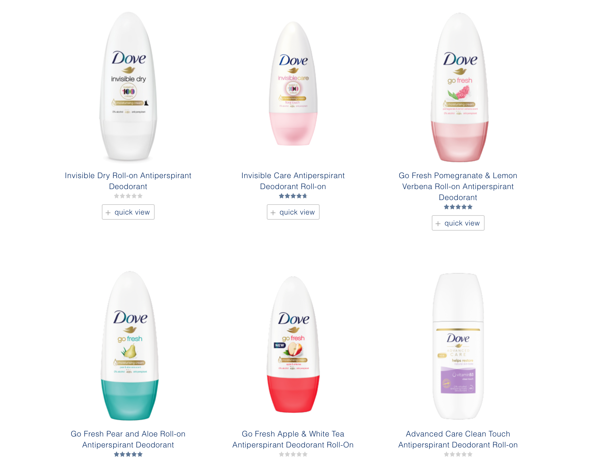
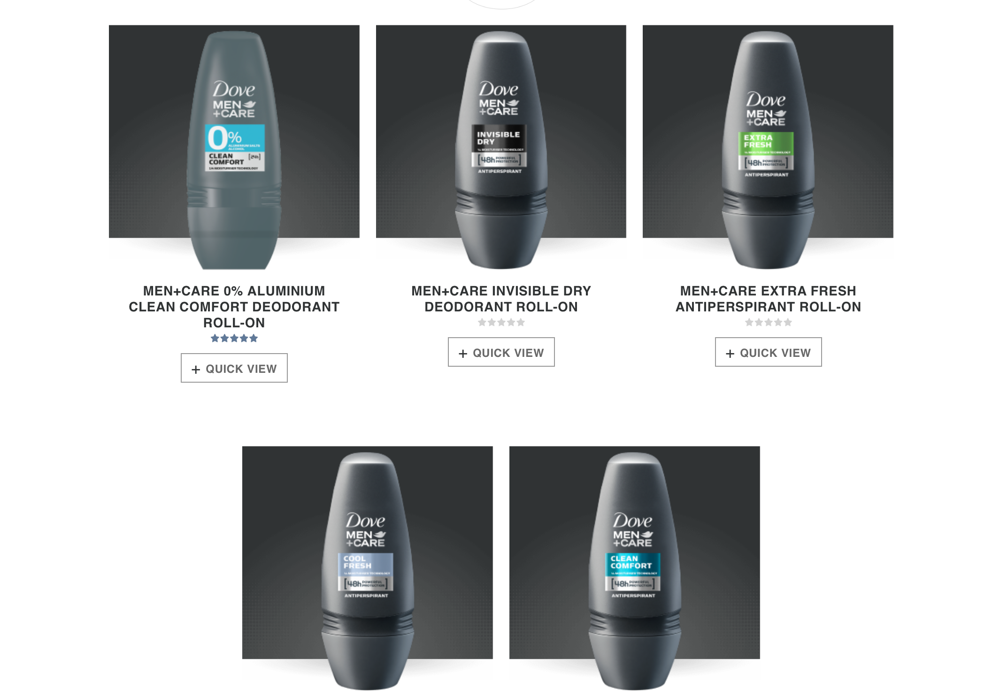

In today’s consumerist society, nobody has the time to ingest and ponder upon every billboard/poster/ad they see. For this reason brands use a variety of semiotics within their marketing depending on the type of audience they are targeting. For instance; bright, primary colours are typically used to target younger demographics. With this strategy, consumers can tell if an ad is aimed at them just by recognising the iconography continuously used to target their specific demographic. One important aspect of this iconography is (of course) typography, and I will be delving a little deeper into how typography is used by brands to target men vs women.

I will be specifically referencing the brand Dove, who produce both men’s and women's deodorant ranges and use juxtaposing typography to market each gender.

Let’s start with the women’s:

The images above are from the women’s deodorant product list on the Dove website. As shown, the typeface on the deodorant stick consists of a centrally aligned, regular sans-serif font of which the type is presented solely in the lowercase. The use of lighter fonts, lowercase text and the pastel colours used for the text are intended to attract female audiences as each of these features are traditionally associated with the tranquil nature of women. The shapes acting as an aid to the presentation of the text (e.g the blue ring shape and the gold bar) contain soft edges. Again, this decision was made to reflect a ‘softness’ that is commonly considered a female attribute. These analyses and connotations may seem over-extensive, however once you consider the same factors within the men’s products the picture becomes a lot clearer.

Now, moving on to the distinctly contrasting men’s products. The text here is a bold, wholly capitalised, sans-serif font and has a flush-left alignment. The bold font and capitalised text is a complete reverse of the typography aimed at women and represents an intensity and sense of confidence that aligns with masculine stereotypes. For this same reason, the shapes on the product all have sharp edges; to exude a boldness that will attract male customers. The colours of these shapes also reinforce this as they are extremely deep and vibrant in comparison to the pastel colours targeted at the female audience. All of the type on the packaging is black/white to counterbalance the vibrance of these colours.

The one thing that these two products have in common is the font of the brand name; though this was almost definitely done for continuity and branding purposes. All of these gender preconceptions of female timidness and masculine power are not as prominent in today's progressive society as they once were. However, since these gender marketing strategies have been used for so long - we’ve been cultivated to recognise what our products *should* look like. For two very similar products, the typography for each of them is worlds apart and very much reveals the importance and impact that type can have when marketing to specific audiences!