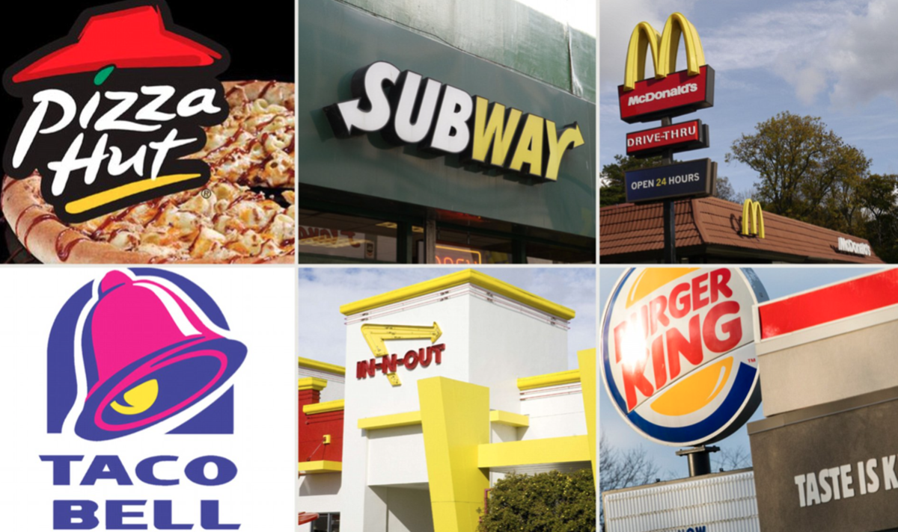
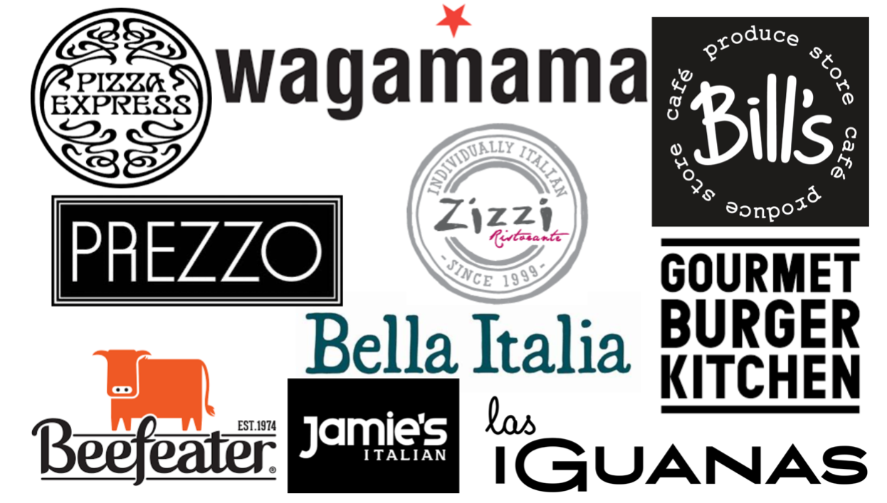

\
When out and about in town, there's one integral time of day that everyone looks forward to: lunchtime! Whether it’s chips and a burger from a diner or a fancy italian three course meal, a day out just isn’t complete without grabbing a bite to eat. However, surrounded by endless options, how do we distinguish the difference between fast food and sit-down restaurants? Well, different types of dining experiences use contrasting typography within their logos and shop signs in order to allow consumers to navigate their way through a labyrinth of lunch options.

Fast food restaurants want to get the message across that their dining experience will be casual, quick and cheap. They do this through the use of sans-serif fonts and bright colours. As seen above, it is evident that bright yellows and reds are popular colours for fast food advertisements. This is due to the fact that red has connotations of hunger and impulsiveness; which fits with the model of fast food restaurants as customers often receive their food without much time to think about it. Bright yellows connote happiness and comfort, which also coincides well with fast food as the meals they offer are commonly referred to as ‘comfort food’. These bright colours are also needed to compete with other signs they may be next to; fast food restaurants are often located on busy high streets and need these attractive colours to draw the eye and entice customers. The bold sans-serif fonts also reveal the casual nature of the brand, it ensures the customer that the dining experience will be informal rather than formal which also reflects their ‘casual’ prices, often being very accessible. For instance, Mcdonalds meals range anywhere from 99p upwards.

Dine-in restaurants use a minimalistic approach to their marketing and typography in order to connote a luxurious and high-quality experience and justify the prices of the meals which are more costly than fast food. Colours used are commonly shades of black and white as this signifies modernity. Serif fonts are used to indicate a more formal and fancy setting; each restaurant tends to use a unique and recognisable serif font in order to distinguish between each individual brand, as they all use the same desaturated and tame colour palettes. As seen in the image above, restaurant brands also use sans-serif fonts to further imply a modern style and simplicity e.g GBK and Prezzo.

So next time you’re perusing around your local shopping mall and get a bit peckish, think about what type of lunch experience you’re after and watch out for these typotactics to select the best option for you.