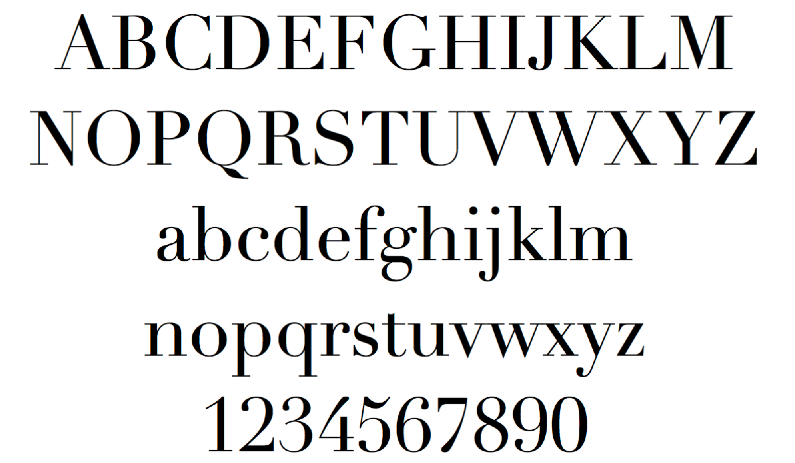
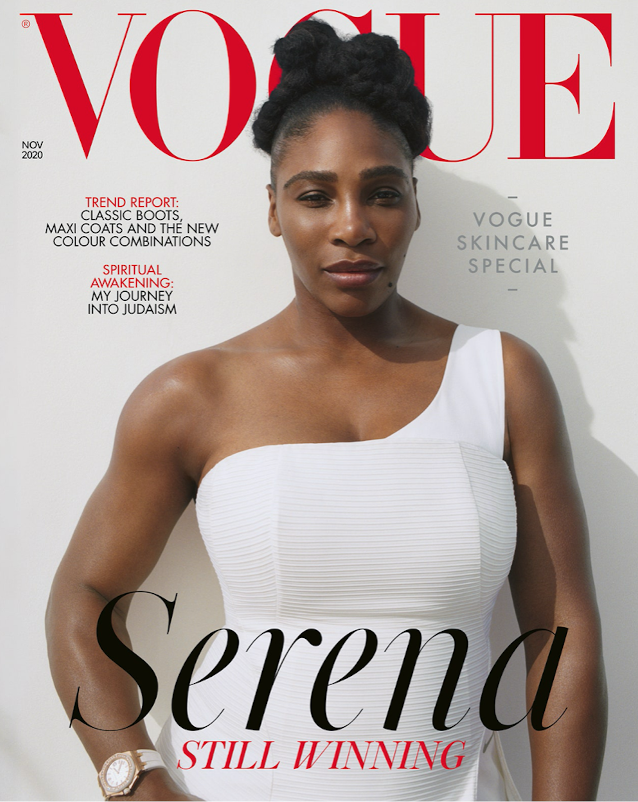

The Didot typefaces were first created in 1984 by the Didot family; a family of french printers and publishers. Despite being interjected into the world of typography almost 250 years ago; Didot remains a significant icon in high fashion companies. Didot is implemented by many substantial brands such as Harper’s Bazaar, Elle, Giorgio Armani, Zara, Louis Vuitton - and lest we forget one of the largest names in the world of fashion; Vogue Magazine. Used by colossal companies such as these, it is no surprise that the Didot typeface is often associated with style and elegance - but how did it come to be used by these giants in the first place?

When Didot was first designed it was something unique that hadn’t been seen in the typography industry before. This is mainly due to the extreme contrasts between the slender, hairline serifs against the bolder body of the letters. This is mostly recognisable within capital letters that have multiple vertical strokes, such as A,M,N, U and V.

High fashion companies often justify hefty price tags by being associated with qualities such as elegance and luxury. The Didot typeface assists this sense of opulence as the slim serifs create more white space on a page; the more white space, the more wealthy and luxurious a brand is thought to be; it suggests they have money to spare by not cramming their pages full of information.

It is for this reason that Didot is often referred to as neoclassical; serifs are known to be vintage however the sleekness of the Didot serifs give the type a modernistic feel. The use of high contrast allowed the typeface to be instantly distinguishable from others; although this quality has now been adapted into many other fonts used within the fashion world.

However, while the use of contrast within the typeface seems to be its greatest strength, it could also be considered its greatest downfall. The thin strokes have a ‘dazzle’ effect on readers of the typeface. This means that when Didot is presented in a smaller size, the bold verticals are competing with the slimmer segments of each letter; causing the text to be somewhat illegible. Henceforth, Didot is rarely used as a body text and is much better suited to large headlines and titles. To tackle this issue, variations of the Didot typeface were developed with less contrast in order to adapt the font for body text use.