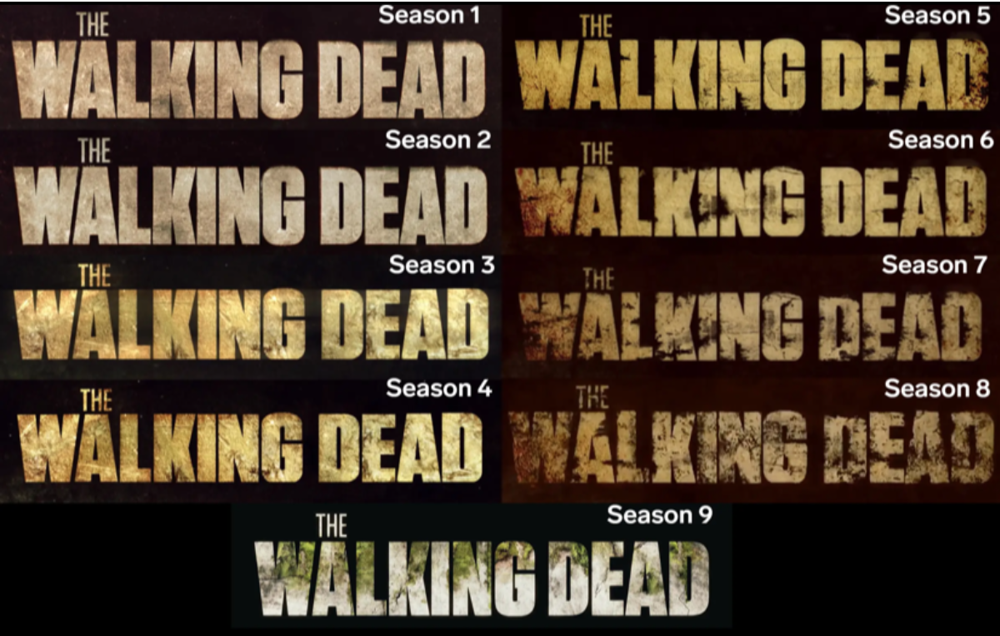
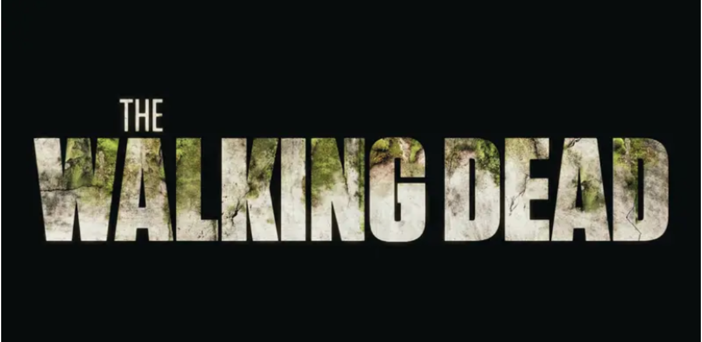

Approaching its eleventh season, The Walking Dead has been an internationally adored TV series since its debut in 2010 and consequently its title has become iconic among horror fans. The word ‘The’ within the logo is a light-weight, condensed sans-serif font and is significantly smaller than the rest of the logo due to the trivial nature of the word. The ‘Walking Dead’ is a low-contrast, compact and heavy sans-serif font. All of these features add to the boldness of the text which emphasises the importance of the words as ‘Walking Dead’ reveals exactly what the series is about. This is further reinforced by its colossal size compared to ‘The’.

While this use of typography may seem slightly simple and unoriginal, what makes it engaging and unique is how they transform it over the show’s seasons. Due to the popularity and success of The Walking Dead, winning ‘Television Programme of the Year’ from it’s very first season; The Walking Dead title is so widely known that almost anyone will recognise the title no matter what form it’s in. This allows the creators to play around and experiment with the title - and that’s exactly what they did.

Representative of the apocalyptic narrative; each season the typeface progressively decays, reflecting the characters’ situations increasingly getting worse over time. This is done by yellowing the type as if it were rotting and adding brown shading to certain parts of the letters to imply they are now dirty. As you can see in the image below this is particularly noticeable from seasons 6-8 where the letters; especially the ‘W’; begins to perish completely. It is at this point in the show where a new villain is revealed who shatters the walls of hope and safety the main characters were starting to build, hence the drastic changes made to the title.

As seen in the image below, season 9’s title is slightly different from the rest. While still greatly transformed from the previous season, the type has more positive connotations of rebirth and promise. This symbolises the turning of tides for the characters in the newest season; previous worries no longer haunt them and they have started to build a foundation for a somewhat normal and peaceful life. This change of narrative is illustrated in the type,  though still slightly cracked and dirty the use of a whiter shade and more intact lettering, embodies a light at the end of a tunnel. The title is also embellished with greenery which can be associated with re-growing their lives and the vegetation the community have been able to survive on.

This creative use of typography adds to the action-packed story of The Walking Dead and further manufactures an extremely engaged and eager fanbase as only dedicated fans of the series may pick up on these ongoing typographic transformations. While the depiction of zombies and the apocalypse may be overdone, the use of transforming typography to tell a story is certainly not.