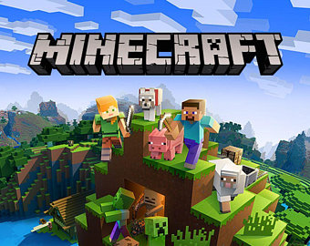

The majority of you are most likely aware of this game but for those who aren’t Minecraft is a world full of ‘blocks’ where players must try and survive by building with nothing but raw materials. Players can craft more complex items such as weapons with these materials in order to fend off monsters who come out at night. Alternatively, players can enter ‘creative mode’ which has no monsters, infinite blocks available and allows players to fly around freely in order to build whatever they desire. The game was released in 2009 and is currently the most sold video game in history, having sold over 200 million units. 

Obviously on TypoTab the question we’re going to ask is, did the typography of the game perhaps have an impact on this tremendous amount of sales? While there is no real way to measure this, let's dive into the typo-tactics used and see what the title can tell us about the game.

The Minecraft font seen in the image above is sans-serif, heavy-weight and low contrast, all of these factors are symbolic of the fact that the text is imitating the ‘block’ style of the gameplay. It is as if the title itself is made of blocks; reinforcing the challenge of the game that the players must make everything themselves with the blocks. The heaviness allows the type to resemble the size of the blocks and the low contrast ensures that all sections of the letters are the same width, as the blocks in Minecraft are all the exact same shape. The text is shadowed with a darker colour to create the illusion of 3D shapes as everything within the world of Minecraft is 3D.

Evidently there are no curves within this title as the letters are extremely rigid to resemble blocks, but also to resemble the pixelated style of the game. The letter ‘A’ contains a creeper face on it (one of the monster species within the game), introducing one of the game’s ‘characters’ to the audience simply from the title. The colour of the title is grey as to not compete with the colourful scenery surrounding it. This colour decision can also be seen as representative of the caves within the game as this is a huge aspect of the gameplay. This speculation is supported by the many cracks present throughout the title.

Although we’ll never know whether the use of this typography contributed to the success of Minecraft, what we can deciviselvy concur is that all of the creative decisions that went into the title effectively communicate the story and contents of the game, possibly persuading potential consumers to purchase it.