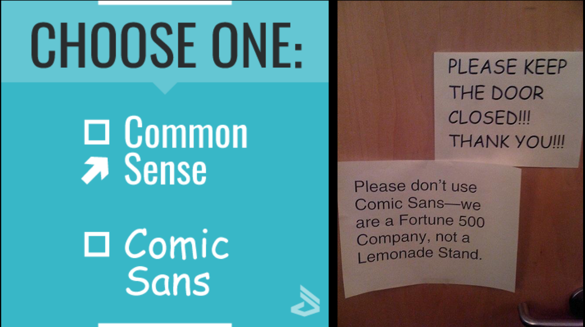
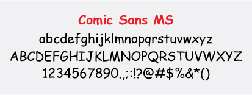

There are two daunting words that will send a shiver down any designer’s spine; that will make anyone shudder and cringe with physical pain. Those two words are (prepare yourself): 

... comic sans. 

This typeface has become every typographer’s nightmare since its creation in 1995, however this resentment has also spread to the general public and it is now socially acknowledged that there is no context on earth that can justify the use of comic sans. But how did we get here? How did this seemingly innocent font accumulate such an infamous reputation?

The name comic sans was given as it is based off of comic strip lettering and its sans-serif nature. The letters within the typeface are very askew; the middle prong of the lowercase 'm' is longer than the others, the lines of the capital 'L' aren’t perpendicular and the horizontal line across the two pillars of the capital 'H' is slanted. This is simply naming a few examples as almost all letters within the typeface have their own unusual features. These features give a casual, lighthearted and playful feel to the text; the font’s imperfections and asymmetrical characteristics resemble a child’s handwriting; the intended target audience for this typeface.

In 1995 Vincent Connare designed the font ‘comic sans’ for a new microsoft software package, Connare has previously stated that the typeface was never meant to be used for anything but writing aimed at children. However, these intentions were quickly set aside when the public accessed the new software package. The comic sans typeface was a refreshing break from the many traditional serif fonts that flooded computers in 1995, so everyone (with no knowledge of how typefaces are used within contexts) started using the typeface -and it very quickly became overused. Due to its popularity, comic sans started being used within formal/serious documents and texts which infuriated designers and typographers alike - so much so that designers Holly and David Combs took it upon themselves to start the ‘Ban Comic Sans’ movement and even started a website to promote their cause. The Combs insist that usage of comic sans is comparable to “ to showing up for a black tie event in a clown costume”.

Does the comic sans typeface deserve this extreme scrutiny or is it simply a sufferer of its own stardom? Feel free to share your opinions in the comment section below!