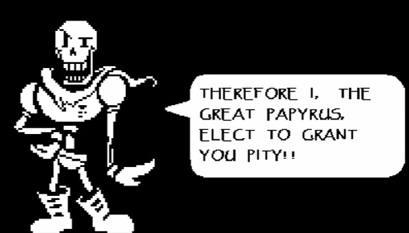
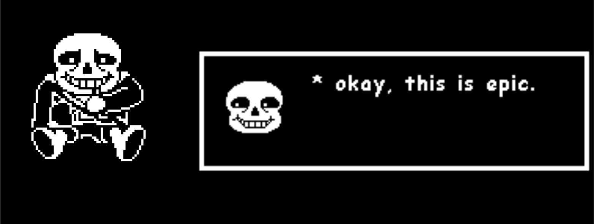
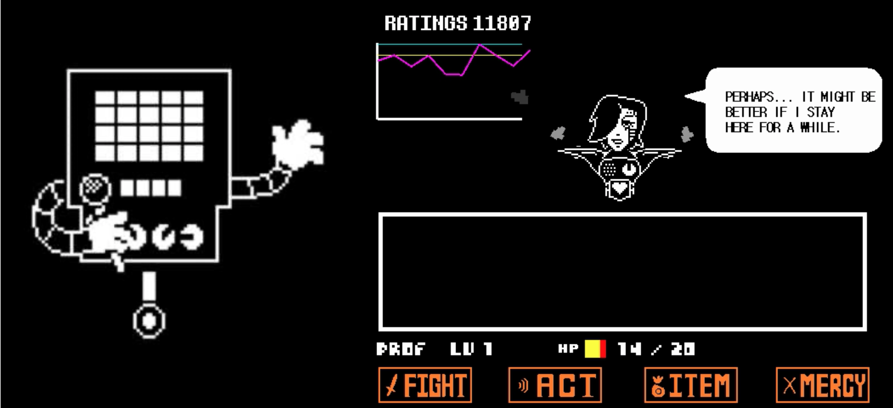
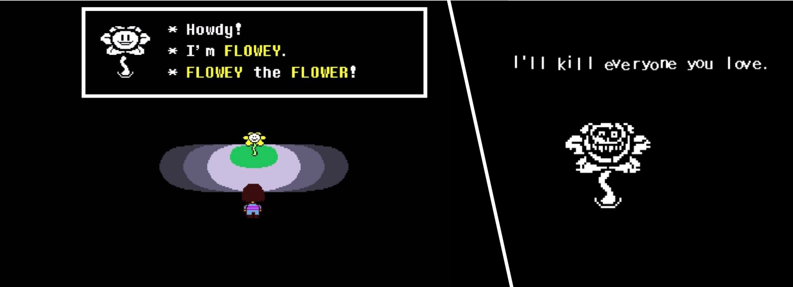

\
If you’re a video game fanatic then no doubt you’ll have heard of the masterpiece that is Undertale. Undertale is a video game created by Toby Fox in 2015 where a human falls down a hole into an underground universe full of monsters and must make it back to the ‘surface’. The game quickly became iconic due to its mesmerising soundtrack and nostalgic retro RPG style, but mainly it's overwhelming success can be accredited to its charming and humorous characters.

Undertale’s use of typography for each character plays a major factor into what makes them so loveable. The game utilises different fonts and typefaces for the characters in order to further emphasise and play into their characteristics. Let's delve a little deeper into how they do this by looking at a few of the characters.

Arguably the most loved characters in the game are two skeleton brothers; ‘Sans’ and ‘Papyrus’, named after the fonts that are displayed when they speak; comic sans and papyrus.

The character Papyrus is very intense, his ongoing mission throughout the game is to become a royal guard (killer of humans) for the king, however he is blissfully in denial of his kind nature that wouldn’t even hurt a fly. As you can see in the image above, the typeface papyrus is chosen for Papyrus’ speech. Papyrus is a light-weight typeface that resembles egyptian hieroglyphics. The unsymmetrical lettering such as the ‘E’ and the differing baseline for each character (see the word ‘Pity’ in the image above), reveals a chaotic nature within the font which is reflected within Papyrus’ intense and upbeat persona. This is further emphasised by the fact that his speech is solely shown in capital letters.

Sans’ persona greatly contrasts from his brother’s, he’s laid back, lazy and doesn’t really have a storyline within the game, his purpose is to appear in different situations and tell questionably funny puns and jokes. As you can see in the image above, the comic sans typeface was chosen for Sans’ speech. Comic sans is a sans-serif, heavy weight typeface, its simplicity is representative of Sans’ laid-back character. His easy-going self is further reinforced by the fact that all of the letters in Sans’ speech is lowercase.

Another much loved character isn’t a main one, but rather a boss battle that happens within the game. Mettaton is a robot celebrity within the underground world with his own tv show, which is on air during the battle, making it all the more hilarious and creative to impress his viewers. The font chosen for mettaton is sans-serif, light-weight, low contrast and condensed. The font is in all capital letters and has a robotic feel to it due to all the letters being comprised of straight lines, it is very simplistic with no personality as robots are expected to be. 

Lastly, the main antagonist of the game; Flowey. Flowey first presents himself as a sweet flower who gives you a tutorial and helps you progress through the game. However once you think you’re nearing the very end of the game, Flowey reveals his true colours and becomes the final (and hardest) villain to defeat. While no special font was chosen for Flowey’s character, the change in typography between his friendly facade and his evil side is worth noting as it’s a great way to make the story more impactful. 

All of these typographic decisions were made to make the endearing story of Undertale even more engaging and atmospheric. Using type and fonts to tell a story is not done enough in video games and Undertale is a great example as to why it should be done more!