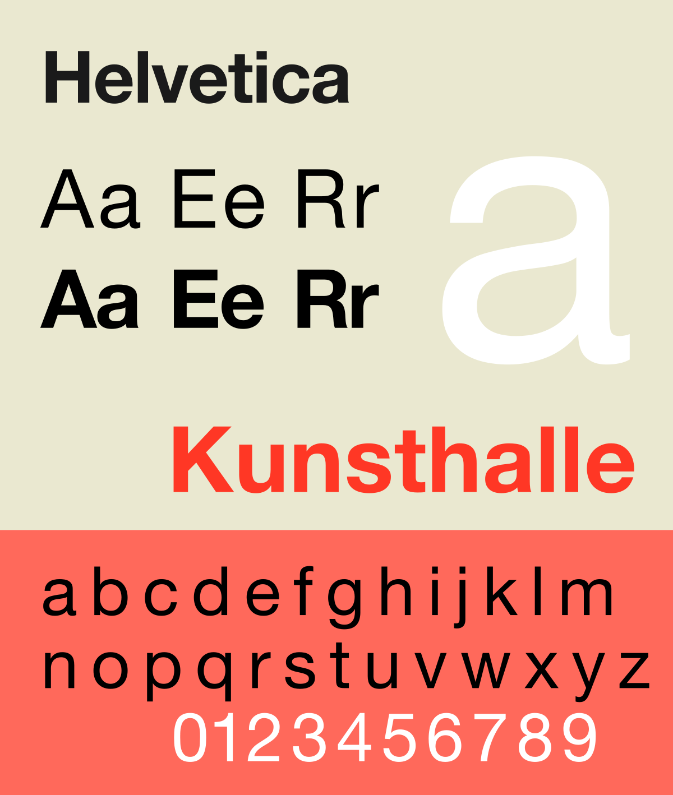
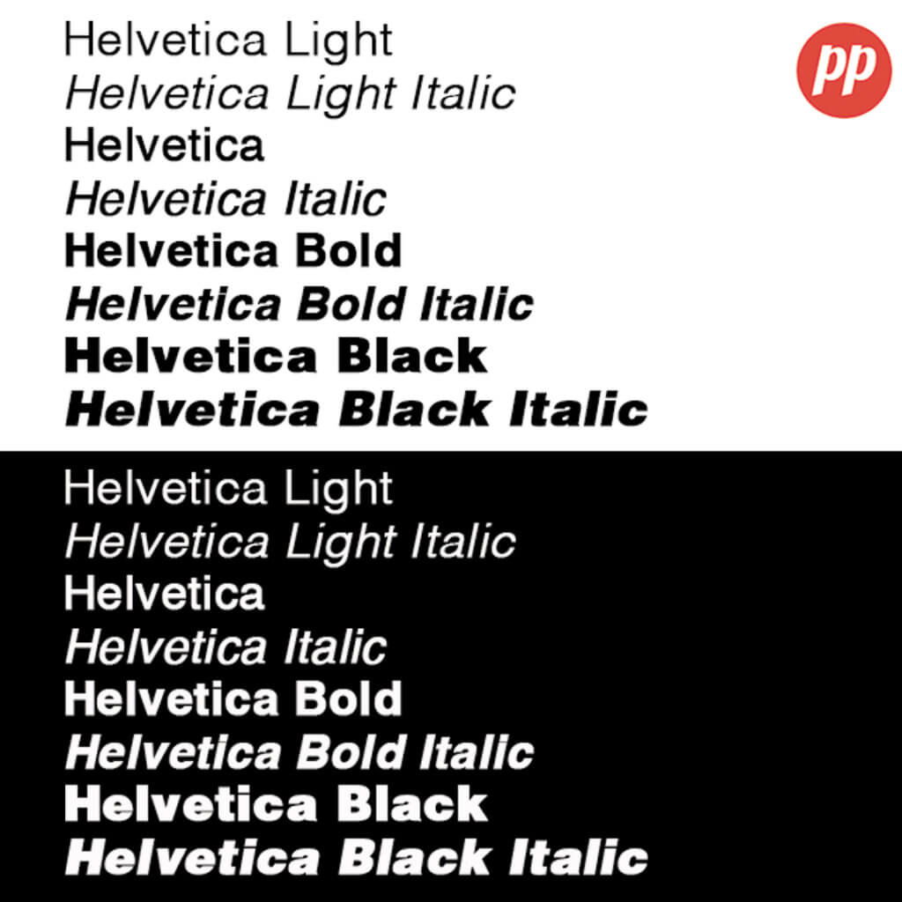

First created in 1957 by Max Miedinger, a swiss typeface designer, Helvetica means ‘Swiss’ in Latin and is a sans-serif typeface that was originally named ‘Neue Hass Grotesk’; an homage to the typeface’s neo-grotesque qualities. However the name was changed to Helvetica in 1960 in order to make the typeface more internationally marketable.

Miedinger’s motivation behind Helvetica was to make a completely neutral typeface that could be used by the masses as it has no intended meaning behind it and would be suitable within all contexts. It would be an understatement to say he succeeded as Helvetica is now the most used font in the world. 

Below are just a few of the many established companies who use the Helvetica font for their branding:

Helvetica is a sans-serif, low contrast, condensed and monotone typeface with a notably high x-height. All of these features add to its solidity, simplicity and modernistic look. The typeface is also easily readable in both print and digital. It is also legible while in motion, making it appropriate for airline and car logos. Graphic Designers choose Helvetica due to its simplicity; the font doesn’t take away from their overarching narrative whether that be their logo/imagery/message. It has the ability to make a brand aesthetically pleasing without taking the focus away from the brand itself.

The Helvetica typeface has been such a phenomenon in the world of typography and branding that many other font variations of Helvetica have been created. This is mainly to give designers a variety of typefaces to choose from while still making use of the extensively neutral and modern attributes of Helvetica:

Even though it was first designed over 70 years ago, Helvetica remains a subtle yet prominent figure within this consumerist society. You can expect to see it daily on billboards, TV adverts, online, subway posters and even on moving cars and planes! 

What do you think about Helvetica, does such a simple typeface deserve this prestige and legacy? Let us know in the comments below!