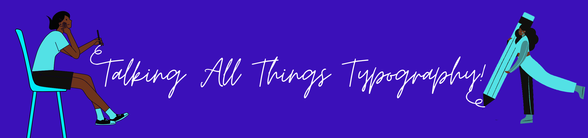

TypoTab is a blog where we analyse anything and everything from the world of typography; whether it be the history of an individual font, how brands use specific typefaces or typography used in everyday life - TypoTab covers it!

I chose the name TypoTab for the brand as the alliteration allows the word roll off the tongue and makes it memorable. The name also explains exactly what it does on the tin: a tab in your browser that explores the use of typography in a diverse range of contexts.

The logo for the blog consists of a shortened name of the brand 'tab'; each letter in a different font. The 't' is a lowercase, heavy weight, sans-serif font. The 'a' is a lighter, underlined sans-serif font and the 'B' is a capital serif font. I used 3 contrasting typefaces to reinforce the range of typo-tactics and typo-topics that will be discussed on the blog. Surrounding the name is a magnifying glass to convey the analysis that will be conducted on these topics here on Typotab!

The banner image featured on the blog is comprised of a sans-serif, cursive typeface with one woman holding a pencil either side of the text to further play into the handwritten style of the font. The type reads 'Talking All Things Typography!'. This slogan recycles the use of 't' alliteration within the brand name, again to ensure readers remember the name and purpose of TypoTab. The banner also utilizes the same colour palette as the logo so that readers will associate the vibrant purple and cyan colours with the TypoTab brand.

